# Learning Objectives: 
By the end of the session, you will be able to:
- Understand how Git internally represents data 
- Visualize and interpret Git history using advanced `git log` commands
- Use `git diff` and `git checkout` to explore and inspect changes 
- Work with branches: create, witch, and merge them using Git commands
- Resolve merge conflicts manually and understand Git's conflict syntax
- Know safe options to rewrite history 
- Apply best practices for local branching workflows and collaboration
- Understand use references (`HEAD`, branch pointers, and hashes)
- Troubleshoot common problems (e.g., pushing large files, bad commits)
# Git Internals & Design Philosophy

- this part is based on the lecture about "Version Control (Git) - The Missing Semester of Your CS Education" (for self studies you can also go to: https://missing.csail.mit.edu/2020/version-control/)
## Motivation

- Problem with Git: the interface is terribly built
	- It is possible to just learn some commands by heart (this is what we kind of did in the Git / GitHub Introduction) 
		- The problem with that approach is that you are lost if something goes wrong and you end up just resetting / rebuilding everything
=> So this advanced lesson aims to show you how git works 
- The design and ideas behind Git are understandable, and if you understand the basic underlying structure everything just makes much more sense and it is easier to understand the interface of Git 
- If you understand the structure, you're not lost when something breaks or conflicts arise
- You know what you're actually changing when you use git commands 

## Git History 

### Understanding the structure of a directory
- Git models history as a collection of folders within a top-level directory 
- First of all, we will look at an example directory and how such a directory can be structured 
- Look at this example directory: 
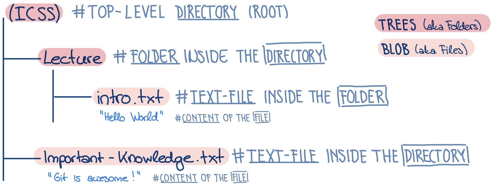
	- As you can see we got a `(ICSS)` which is the top-level directory (root - a folder on your computer that you want to be tracked with all its content by Git)
	- Furthermore, we have e.g. another folder called `Lecture` inside the `(root)`directory
		- inside this folder there is a text file called `intro.txt` and within this text file e.g. the content *"Hello World"* is saved 
	- In this example the `(ICSS)` directory contains a text file beside the `Lecture` folder named `Important_Knowledge.txt` where the content *"Git is awesome"* is saved

> **Important Terminology**
> - Git calls the things we call *folder* **tree**
> - and the things we call *files* Git calls **blob**

- A directory is a recursive data structure meaning...
	...trees can contain other trees or files 
	...but files cannot contain trees

### Understanding how Git models the history
- We now know how we can model our folders and files
- The question now is: how can we model the history (changes made etc.)?
	- An easy approach would be to take a snapshot of the entire directory every time a change is made
		- This way the history would just be a linear sequence of snapshots 
		- This is how you can imagine a linear structure of history
			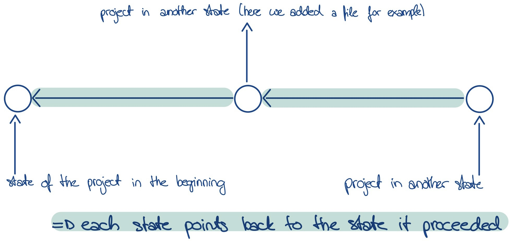
		- A node represents a Snapshot and the Snapshot includes the entire content of the `root Tree`
	- Git uses an approach that is a bit more complex than that -> it uses a directed acyclic graph (DAG) to model the history 
		- Each snapshot has a number of parents 
		- A node can have multiple children/parents and this allows us to work on two different tasks at the same time in different snapshots 
			- Using the Git terminology: this way we can branch the history in two separate forks
		- Example: 
			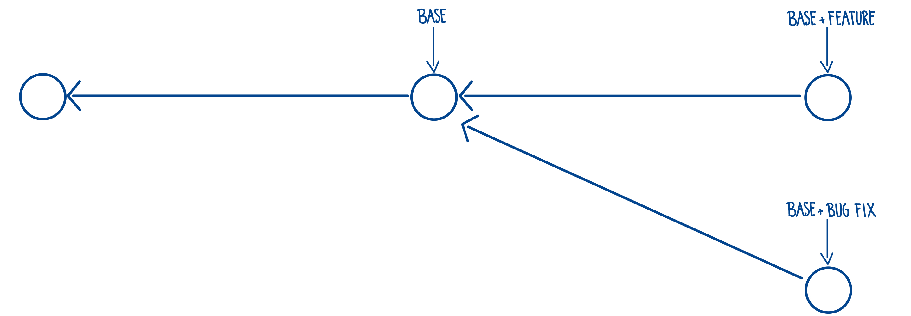
			- The first node is like a `base` snapshot 
			- I now want to work on a `new feature` but at the same time I have to `fix a bug` 
			- Based on the `base` Snapshot, I create a Snapshot where I work on the new feature while I also create a Snapshot based on the `base` Snapshot to fix the bug 
			- So with Git I can work on two different tasks - creating a new feature, fixing a bug - separately 
		- Then, after working on things separately, I can create a new snapshot that merges both things together 
		- In our example: 
			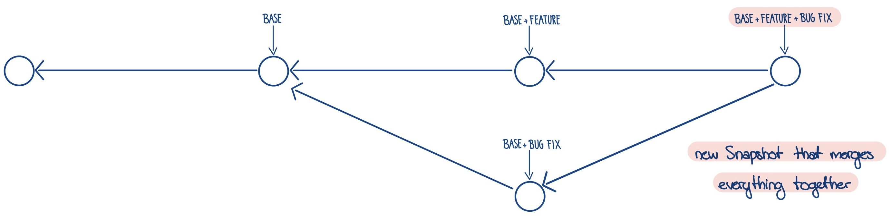
		 -  Important side note regarding merge:
			- When merging Git will already try to combine the changes in a way such that it retains all the important changes without one change "disabling" the other
			- BUT: if it gets confused since there are contradictions it will report a merge conflict and leave it up to you - the programmer - to figure out how to combine the different changes
		- Important note regarding the content of a node:
			- In Git, it is effectively each commit: it points to a full snapshot of the directory and contains metadata like author, message, and parent commit(s)
=> So Git's way of version control allows branching to be able to work on things in parallel and then merging together; so it has much more functionality than just taking snapshots like a linear history does 

## Data Structure 
### Git Model History
- Now we want to take a closer look at how the data structure explained above is actually represented in Git
- We have files and folders. A folder can point to either another subfolder or a file. 
- Furthermore, we have a commit, which is a snapshot of the entire tree structure at a specific point in time, along with metadata (e.g., author, message).
- In practice, Git stores all of this using pointers: every object (blob, tree, or commit) is stored and referenced by a unique ID (its hash).

> **Pseudo Code for Git Model History** (*for those interested*):
> type blob = array \<byte\>        \\\ *a file*
> type tree = map \<String, tree | blob \>  \\\ *a name that maps to either another tree or a file*
> 
> \\\ *a snapshot of the entire tree structure + the meta data*
> type commit = struct {
> 				parents array \< commit \> \\\ *(multiple) snapshot(s) made before*
> 				author: string \\\ * example meta data*
> 				message: string  \\\ * example meta data*
> 				snapshot: tree \\\ top-level tree corresponding to your commit
> }
### How Git stores and addresses the Git Model History Data
- As mentioned above: Git stores data using a **hash function**.
	- Every object in Git — whether a **file** (blob), **folder** (tree), or **commit** — is given a unique ID based on its contents.
	- This ID is a 40-character string, the result of a hash function (e.g. `4af32c...7f`).
- Since these hash IDs are long and hard to remember, Git introduces **references**:
	- A reference is a human-readable name (like `main`, `feature-login`, or `HEAD`) that **points to** one of those hash IDs.
	- Think of it as a **shortcut** or **bookmark** to a commit.
- So, in the end Git, stores:
	... A set of **objects** (files, folders, commits), each saved and accessed by its hash.
	... A set of **references** that map human-readable names to those hashes.
- So when you run Git commands, you're either:
	- Creating or changing **objects** (e.g., making a new commit),
	- Or updating **references** (e.g., switching branches).

**Important Note**:
- Git history — the graph of commits — is **immutable**.
	- You can add new commits or references,
	- But you cannot change existing ones.
	- If you "rewrite history", Git actually creates new commits with new hashes — it doesn't modify old ones.

**Visualization**:
```
[blob] <-- hash --> "ae4f...98"
[tree] <-- hash --> "e9d3...01"
[commit] <-- hash --> "4af3...7f"
             ↑
         reference: "main"
```

>**Pseudo Code for Git Storing** (*for those interested*):
>type object = blob | tree | commit \\\ *in Git all objects are content adressed*
>objects = map\<String, object\>
>
>def store(o):
>	id = shal(o) \\\ *hash-function to store a big piece of data and turn it into a short string*
>	object\[id\] = o
>
>def load(id): 
>	return object\[id\]
>	
>\\\ *Code for a reference*:
>references = map\<String, String\> 
>
>\\\ *Example for such a reference:*
>"fixed-encoding-bug" -> "4af32c...7f" \\\ *human readable name is mapped to a hash-function output*

## Exploring Git history with git commands
### `git log`
- As we have seen Git stores your entire project history as a graph of commits 
- The `git log` command helps us visualize the history but it shows a linearized version of it, not the graph itself
	- if you want to see the graph you can use the following code: 
		`git log --all --graph --decorate`
- It shows the commit with the hash and afterwards in brackets the reference
- Example: 
1. I created an empty working directory and then initialized this empty Git repository 
2. I created a new file `hello.txt` with the text "hello world"
3. Then I staged and committed the file
4. Next, I changed the file by adding "another line" and staged and committed this change
5. Then, I ran the command `git log --all --graph --decorate` and got the following output:
	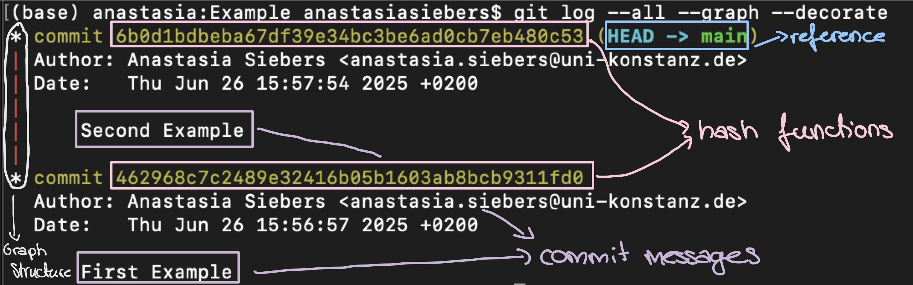

> **Excursus  - `HEAD`**:
> - `HEAD` is the reference to the current commit your working directory is based on - in other words, it's where you "are" in the Git history
> - When you're on a branch, `HEAD` points to that branch 
> - When you make a commit, Git updates `HEAD` to point to the new commit 
> - You can move it around with `git checkout` which we will discuss below
### `git checkout`
 - If you want to look at an earlier version of your file you can use `git checkout` and the first few digits of the hash and it shows you the state of the file and that commit 
 - Example:
	 1. First, we look at the state of the text file after the two commits (should be "hello world \\\ another line")
	2. Now, we move to the version we had after our first commit (just "hello world") with `git checkout`
	3. If we now use `git log --all --graph` we can actually see where we are in the project’s history (see `HEAD`)
		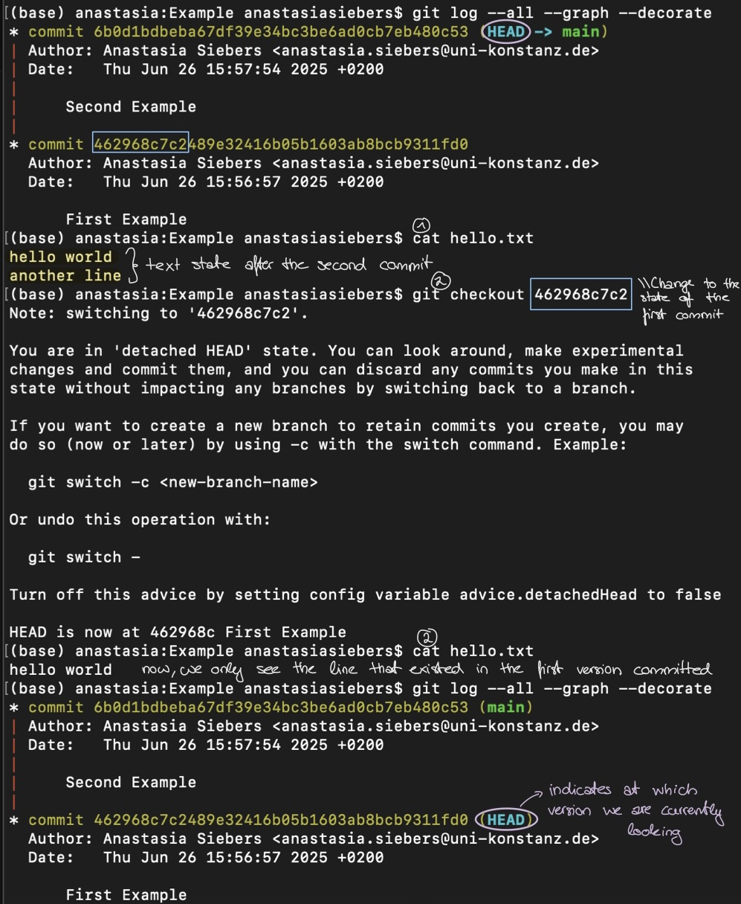
		-> **Note**:
			- `main` is the reference for the second commit so if you want to go back you do not need to use the hash function but could also use: `git checkout main`  
### `git diff`
- This command can show you what has changed since the last snapshot - helpful for understanding what's currently changing in your project
- Example:
	- I added a new line in the text file but didn't commit it yet
	- `git diff` shows what I have added - the line "we can add even more"
		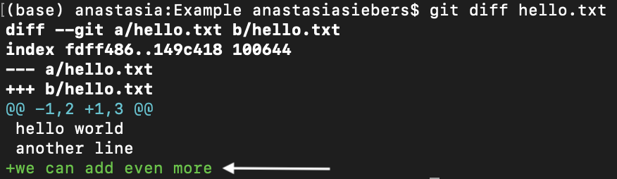
- You can also use `git diff` with the hash of a different version to see what has been added since then 
- Example:
	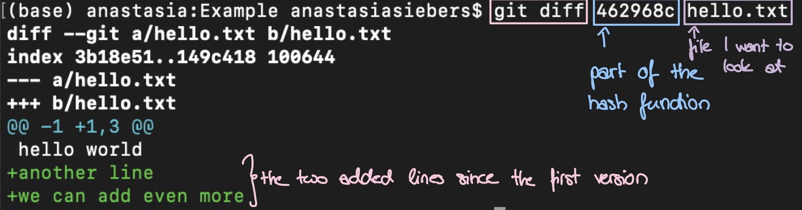

# Branching Workflows & Collaboration

- To get a better understanding of how branching works we will write a simple program 
- We start off with this little program that prints "Hello" when you run it: 
	```
	\\ Python file called animal.py (you don't have to understand the code, just 
	   keep in mind what it does: it prints "Hello")

	import sys 

	def default():
		print("Hello")

	def main():
		default()

	if __name__ == '__main__':
		main()
	```
- Now, we want to use git branches to have parallel lines of development 
- The `git branch` command lists all the branches that are present in the local repository 
- If we say `git branch name` where `name` is the name you want to give the new branch, Git will create a new branch - which is just a reference - that points to the same place that we are currently looking at 
- In our example:
	- we create a new branch (reference) called `cat` which points to wherever `head` was pointing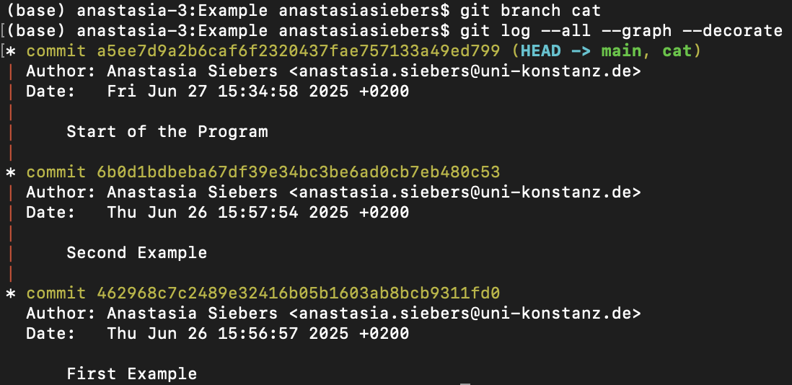
- Now, if we want to switch to the branch `cat` we can use `git checkout cat` to do so 
	- What will change?
		- `HEAD` will point at `cat` 
	- If we now make changes, these changes will be made at the `cat` branch and the `main` branch will point to the "old" version
	- Example:
		- We modify the `.py` file and add a function specific to the cat branch
			```
			import sys 

			\\Define a cat function
			def cat():
				print("Meow!") 
		
			def default():
				print("Hello")
		
			def main():
				if sys.argv[1] == 'cat': \\ if we give the cat argument
					cat() \\call the cat function
				else: \\otherwise,...
					default() \\...call the default
		
			if __name__ == '__main__':
				main()
		    ```
		    - this leads to the following outputs: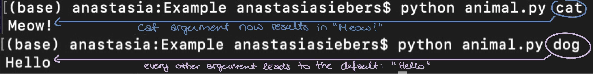
	- Now our `git log --all --graph --decorate` history looks like this: 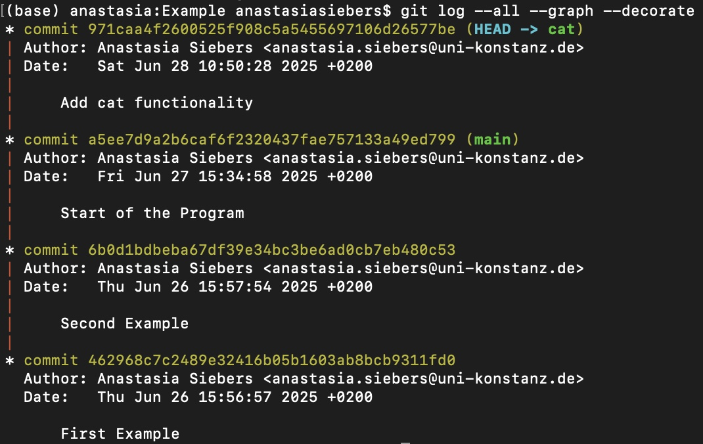
	- If we now went back to the `main` branch the version of `animal.py` would be the one before adding the `cat` functionality
	- **Hint**:
		- If you want a shorter representation of the `git log --all --graph --decorate` you can use the following command `git log --all --graph --decorate --oneline`
	- Now suppose we want to work on the `animal.py` simultaneously and while we added the `cat` functionality someone else adds the `dog` functionality 
		- Both start from the `main` branch
		- We already created the `cat` branch
		- Now, we are going to create the `dog` branch:
			1. Create new branch (!starting from `main` (`git checkout main`!))
			2. Switch to that branch
			=> **Hint**: you can combine step 1 and 2 with the following commands:
				either `git branch dog; git checkout dog` or `git checkout -b dog`
			3. Now we can edit the `animal.py` in the `dog` branch 
				```
				import sys 
	
				\\Define a dog function
				def dog():
					print("Woof!") 
			
				def default():
					print("Hello")
			
				def main():
					if sys.argv[1] == 'dog': \\ if we give the dog argument
						dog() \\call the dog function
					else: \\otherwise,...
						default() \\...call the default
			
				if __name__ == '__main__':
					main()
			    ```
			4. Last step is to add and commit the changes of the file  (
				- !Attention: we now have this version on the `dog` branch; the other version with the cat functionality is on the `cat` branch and the "basic" program is on the `main` branch)
				- we can take a look at this with the command `git log --all --decorate --oneline` 
- Now, we know how to create different branches that split the project into two different versions
	- I can change between those versions with the `git checkout` command
- But, now it would be great to combine these two versions in order to have a program that has both functionalities
	- Therefore, we use the opposite of branching - merging (`git merge`)
	- Step-by-Step:
		1. We go back to the `main` branch before there is this split with two branches with two different versions 
		2. You can just enter the command: `git merge cat dog` and it will work 
		3. But here is a more detailed way of doing it to understand what is happening
			- First, we can run `git merge cat`
			- There it says "fast-forward"
			- That means the `main` branch will simply be updated to the `cat` branch (it will point to the same place as `cat` was pointing). See: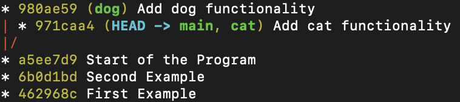
			- Now, if we run `git merge dog` we run into a problem. Why? It cannot be simply "fast-forwarded" 
			- This is why we run into a problem - a merge conflict: 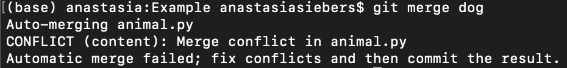
			- So, what can we do, if we encounter a merge conflict?:
				- Don't panic 
				- You can always reverse trying to merge by using `git merge --abort`
				- Or you look at your file with `vim`
					- there we can see our problem: 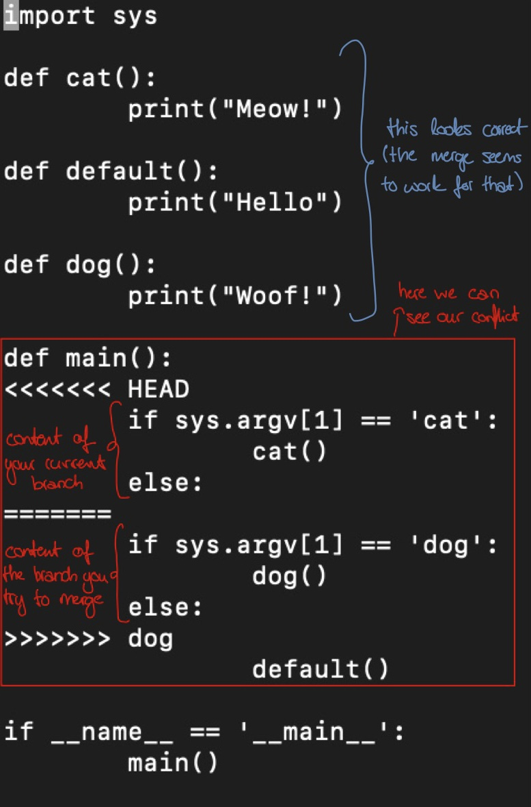
			- Since Git doesn't know how to resolve this conflict it is up to the programmer 
				- BUT you can directly edit it in the VIM -> what we need to modify: we have to change the second if to an elif 
			- After fixing the file on our own in the VIM we can just tell Git to continue the merge with `git merge --continue` but first we have to re - add the file with `git add` 
			- Now, our graph looks like this:
			- and we can use the `dog` and `cat` functionality when running the `.py` file. See: 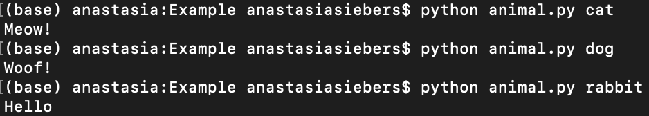
# Rewriting History 
- There are different commands for rewriting Git history 
	- Since Git's data structure is immutable (see above), rewriting history isn't straightforward
- You always have to be careful when rewriting Git history 
❗️❗️**IMPORTANT**: Only rewrite local commits - NEVER rewrite shared history
### Amending commits 
- Refers to adding or removing files from a commit
- We will focus on how to add a file to the latest commit; so you don't have to create a new commit 
- We can do this by:
	1. Staging the files 
	2. Use `git commit --amend --no edit` (the `--no edit` flag tells Git that you'd like to leave the commit message of your latest commit unchanged / if you want to update the commit message, remove this flag)
- Example: 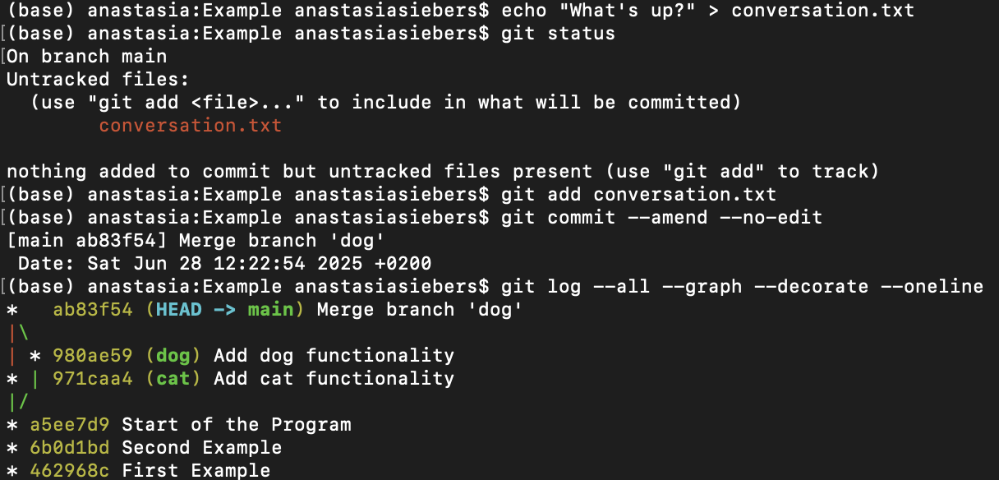
### Delete / Undo the last commit 
- This is especially important if you accidentally try to commit a file that’s too large or have a bad commit 
- Option 1 - Delete the entire commit -> Use `git reset --hard`
	- ❗️ Careful: everything in that working directory and saved with that commit gets deleted 
	- Run the following command: `git reset --hard HEAD~1`
	- Deletes the latest commit and everything in the working directory
	- Example:
		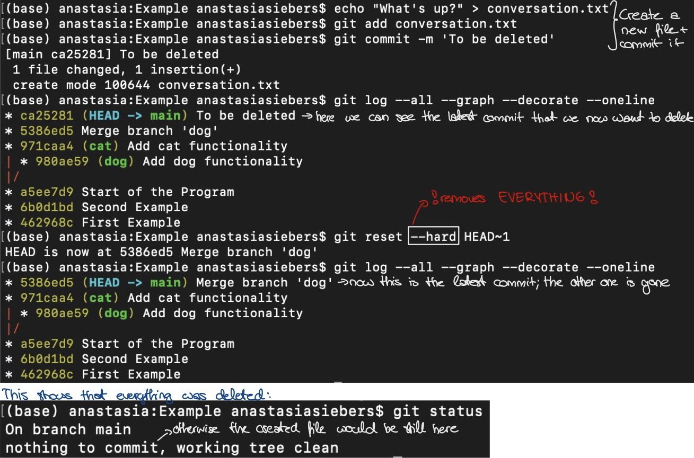
	- the created text file no longer exists
- Option 2 - Undo the last commit -> Use `git reset --soft`
	- This way you can undo a commit but your created file or whatever won't get deleted
	- Run the following command: `git reset --soft HEAD~1` to undo the latest commit
	- Example:
		
	- non-destructive action -> try to use that option (--soft) instead of option 1 (--hard) since not everything gets deleted this way
- We won't go into further details here since it should always be the last resort to delete or undo a commit
- It gets especially tricky if you try to delete / undo a commit that is further down the tree and / or has already been pushed to a remote repository 
- With these two options you will be able to solve a problem that might arise due to trying to push a too large file 

> **Excursus - Using Git LFS (Large File Storage)**:
> - This can help when you're dealing with large files that exceed GitHub's 100MB limit
> - Git LFS is an extension to Git that replaces large files in your repo with lightweight "pointers", while the actual content is stored externally (but still versioned)
> - This allows you to version and share large files without hitting GitHub's 100MB file limit
> - Basic Setup:
> 	1. Install Git LFS (only needed once per machine):
> 		- run `git lfs install` in your terminal
> 	2. Track specific file types - e.g. csv files:
> 		- `git lfs track "*.csv"`
> 		- This sets up a rule that LFS will handle all `.csv` files from now on
> 	3. Add the `.gitattributes` file that was created by LFS :
> 		- `git add .gitattributes`
> 	4. Add your large file 
> 		- `git add big_dataset.csv`
> 	5. Commit everything 
> 		- `git commit -m "message"` 
> 	6. Push to GitHub
> 		- git push
> - Note: Everyone cloning or pulling the repo needs Git LFS installed!

# Final Exercise 
*Exercise 1:* 
After learning about branching, merging and conflicts, it's time to put your knowledge into practice.
This exercise simulates a real collaboration scenario where merge conflicts and mistakes can happen and you'll learn how to deal with them like a pro.
Again, you will need to pair up with a classmate and then decide on who will be Person A and who will be Person B. 
1. Create a repository 
	- Person A:
		- Create a new public GitHub repository called `conflict-practice`
		- Add a text file called `story.txt` and write a short sentence in it (like e.g. "Once upon a time, Git made history simple.")
		- Commit and push the file to GitHub
	- Person B:
		- Fork the repository and clone your fork to your local machine
2. Make Conflicting Changes
	Now, you will both edit the same line of `story.txt` in different ways 
	- Person A:
		- You can change the sentence to e.g.: "Once upon a time, Git was confusing but powerful"
		- Commit and push the change to GitHub
	- Person B:
		- Edit the same line to but to "Once upon a time, Git was peaceful."
		- Commit the change.
		- And now, try to push it. 
3. Resolve the Conflict
	- Person B:
		- Git will reject your push and tell you your branch is behind
		- Run: `git pull origin main` -> you will now see a merge conflict in `story.txt`
		- Resolve it by editing the file manually: keep both idea and write a merged version like "Once upon a time, Git was confusing but powerful and peaceful."
		- Then run: `git add story.txt` and `git commit`
4. Last Steps
	- Push your resolved version to GitHub 
	- Confirm on GitHub that your fork shows the final version.

*Exercise 2:*
GitHub has a file size limit of 100 MB. Sometimes you try to push something larger and Git will stop you. This exercise helps you understand what to do when that happens, and how to clean it up properly using Git tools. 
1. Setup
	- Create a new repository on GitHub called `big-file-test`
	- Clone it to your computer using SSH
	- Create a new local Git repository (***Hint:*** use `git init`)
	- Create a new dummy file that's too large with the following command 
	```
	dd if=/dev/zero of=large_file.csv bs=1M count=150
    ```
	- Add the file and commit it.
2. Try to Push 
	- Try pushing your commit to GitHub
	- GitHub will stop you and show you an error saying that the file exceeds GitHub's file size limit
3. Undo the Commit
	- Use one of the options we learned today
	- ***Hint:*** It is always better to use the `--soft` reset and remove the file manually with `rm large_file.csv`
	- Then commit the change and try to push again
