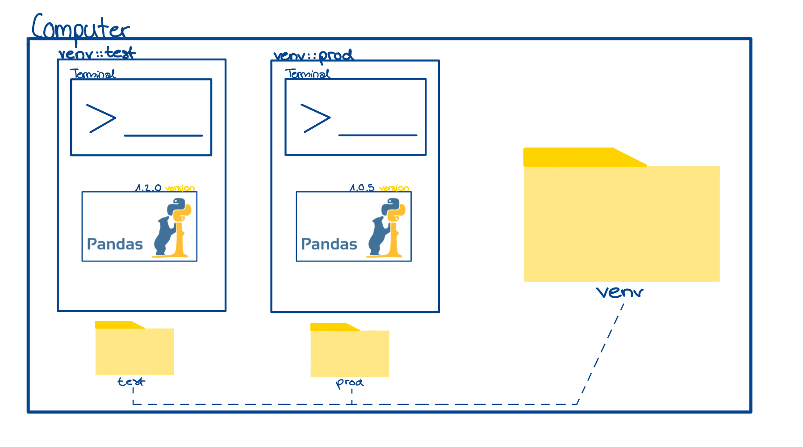

## Learning Objectives
After working through this material, you should be able to:
- Understand what a **virtual environment** is and why it matters.
- Install and manage an **Anaconda environment**.
- Set up **VS Code** with the Anaconda environment and install the necessary extensions.

(This lecture is based on the video [Virtual Environments Explained!](https://www.youtube.com/watch?v=uW99sFcc8tc))

## Why Do we Use Virtual Environments?
- On your computer, you have at least one (often several) package folders.
- A package folder contains all the packages and libraries a program needs to run.
- In Python, common packages are `numpy`, `pandas`, etc., which you install with the command `pip install ...` or `conda install...`
- Each package has a version. Newer versions might fix bugs or add, change, or remove features.
- Problems arise when:
    - Two programs need **different versions** of the same package.
    - One program works (correct version installed), while the other fails due to a version conflict.
=> Virtual Environments can help us solve these dependency problems 

## How Do Virtual Environments Work?
- There are different ways to manage environments in Python (e.g., **Conda**, **pipenv**, or built-in **venv**). 

> **Note:** 
> Your install statement for installing libraries and packages depends on the environment you use (`pip install...` / `conda install...` etc.)

- In general, a virtual environment is just another folder on your computer.
- You can create multiple environments inside this folder:
    - Each environment is its own isolated folder.
    - Inside it, you install packages with the version you need.
    - Two environments can both have `numpy`, but with different versions.
- Visualization:
	
	-> Afterwards you can run the project in their own environment with the right package version 
		
## Reasons to Use Virtual Environments 
1. Dependency Management 
	- As shown above it can help to avoid version conflicts: each program can have exactly the versions it requires.
2. Collaboration 
	 - When you share your project on GitHub, you can also share the environment file.
	- This allows collaborators to install the _exact same_ versions of packages you used.

## Important Terminology
**Virtual Environment**  
- A lightweight, isolated Python workspace.  
- Keeps all the packages and dependencies of one project separate from another.  
- Prevents the classic “it works on my computer but not on yours” problem.  
>*In Plain English:*  
  Think of a virtual environment like a “project-specific toolbox.” Instead of throwing all your tools in one big messy garage (system Python), you keep a smaller toolbox for each project. That way, each project has exactly the tools it needs, no more and no less.  

**Conda**  
- A package and environment manager that comes with Anaconda.  
- Lets you create environments, install packages, and switch between them.  
>*In Plain English:*  
  Conda is like the manager who makes sure each toolbox (environment) has the right tools (packages) inside.  

**Kernel**  
- The engine that runs your Python code inside notebooks or VS Code.  
- Each kernel corresponds to a specific Python environment.  
> *In Plain English:*  
  If the environment is the toolbox, the kernel is the worker who knows how to use those tools.  

## Use a Virtual Environment - Install Anaconda 
-  Visit the [Anaconda website](https://www.anaconda.com/download), download the installer, and make sure to select the **Python 3.12** option.
- Once Anaconda is installed, use `conda install ...` to add new packages.
- Why do we use Anaconda? 
	- If you install the full Anaconda distribution, it already comes with most of the common data science libraries preinstalled, including: 
		- `numpy`
		- `pandas`
		- `scipy`
		- `matplotlib`
		- `scikit-learn`
		- `jupyter`

## Set Up VS Code
1. Install [**Visual Studio Code**](https://code.visualstudio.com).
2. Open VS Code and install the **Python extension** (search for “Python” in the Extensions Marketplace).
3. (Optional but recommended) Install the **Jupyter extension** to use notebooks directly in VS Code.
4. Open the Command Palette in VS Code (Ctrl+Shift+P / Cmd+Shift+P on Mac).
5. Search for Python: Select Interpreter.
6. Select the interpreter that matches your Anaconda environment.

