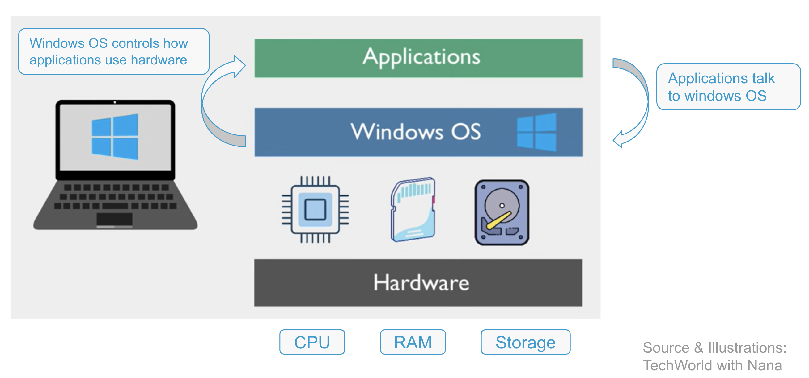
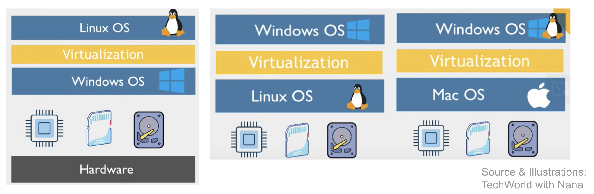
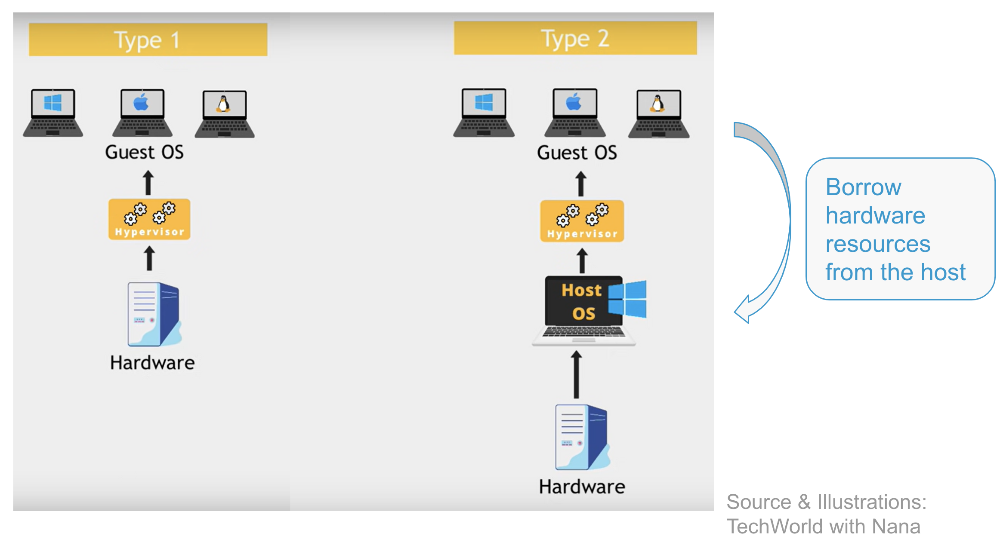
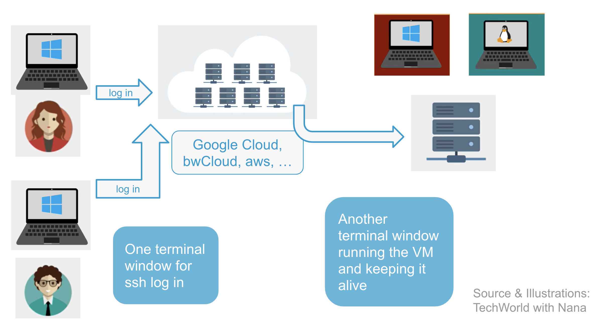
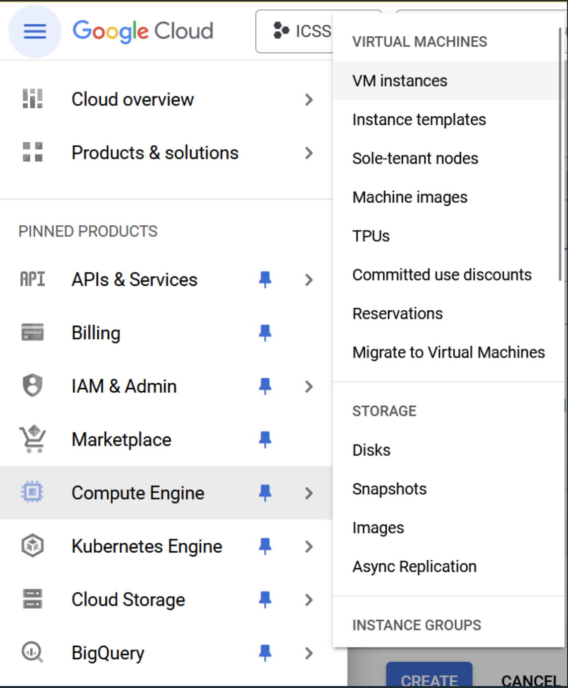
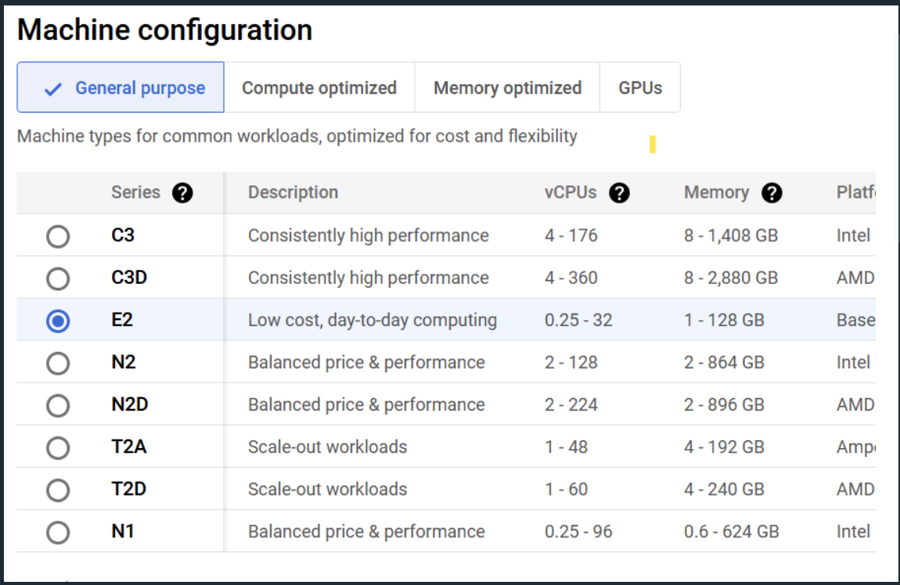
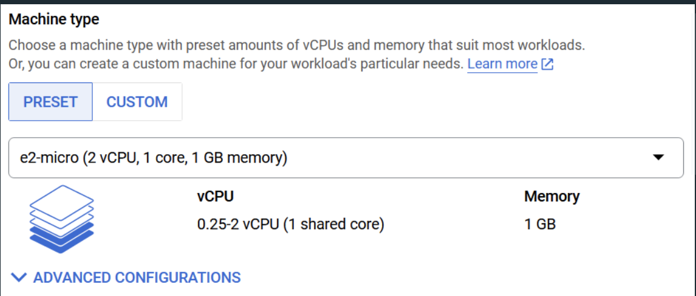
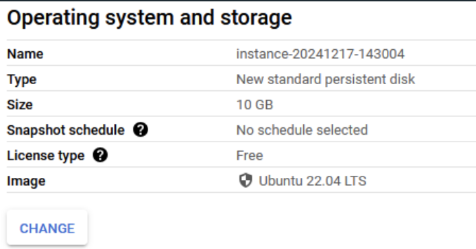
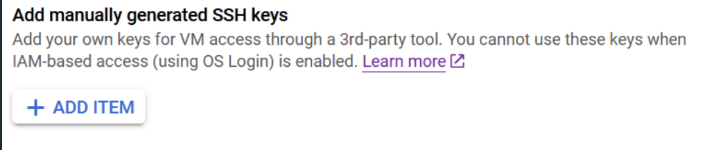

## Learning Objectives
By the end of this tutorial, you will be able to: 
- understand what a virtual machine (VM) is and how it works
- distinguish between Type 1 and Type 2 hypervisors
- explain why VMs are important for data science workflows 
- access and use a remote cloud-based VM via SSH
- launch a Jupyter Notebook server on a virtual machine

(this lecture is based on the YouTube Video: [Virtual Machines explained in 15 Mins" by TechWorld with Nana](https://www.youtube.com/watch?v=mQP0wqNT_DI))

### What is a Virtual Machine?
- A virtual machine is a computer inside your computer
- You have:
	- Physical hardware (CPU, RAM, storage)
	- An operating system (abbreviated OS)
	- Applications that run on it (e.g. Word or Pages depending on the OS)
	- Visual Representation of this basic set up:
		
- Motivation:
	- You want to run Linux on your Windows laptop, without buying a second computer 
	- Or you want to get data with an API in a regular rhythm but want to use your computer for other stuff while this is happening 
- Solution: Virtualization
	- This way you create a virtual computer using the existing hardware or hardware on a Cloud/Server
	- Visually:
		

> **Excursus: Key Concepts - Hardware / Operating System**:
> - Hardware: 
> 	- *CPU (Central Processing unit)*: "The brain of your computer"
> 		- Executes instructions and calculations 
> 		- Runs programs by following code step-by-step
> 		- Determines how fast your computer can "think"
> 		- Measured in GHz - higher means faster processing
> 	- *RAM (Random Access Memory)*: "Your computer's short-term memory"
> 		- Stores information that is actively being used
> 		- Very fast but temporary - contents are lost when the computer is turned off 
> 		- Determines how many programs you can run at once without slowing down
> 	- *Storage*: "Your computer's long term memory"
> 		- Used for saving files, apps, and the operating system itself
> 		- Slower than RAM, but persistent - contents stay even when powered off
> 		- Measured in gigabytes (GB) or terabytes (TB)
> - Operating System:
> 	- The software that sits between your hardware and your applications 
> 	- It provides the environment where programs run and manages all the resources of your computer 
> 	- It manages the hardware and decides how CPU, RAM, and storage are allocated
> 	- It runs applications by letting you open, close, and interact with programs
> 	- Controls files and permissions and decides who can access what
> 	- Provides a user interface 

### Virtualization and Hypervisors
- Virtualization is the process of creating a virtual version of a computer - including its OS, CPU, memory, and storage - all running on top of real hardware
- This is achieved using a Software called a hypervisor, which creates and manages virtual machines
	- The technology allows one physical machine to run multiple virtual machines (VMs)
	- It manages and allocates resources (like CPU, RAM, and storage) to each VM
	- There are two main types: 

| **Feature** | **Type 1 Hypervisor (Bare Metal)** | **Type 2 Hypervisor (Hosted)**     |
| ----------- | ---------------------------------- | ---------------------------------- |
| Runs on     | Hardware directly                  | On top of an existing OS (host)    |
| Use case    | Servers, cloud computing           | Personal computers, testing        |
| Examples    | Google Cloud, VMware ESXi          | VirtualBox, VMware Workstation     |
| Performance | High (used in production)          | Lower (some overhead from host OS) |

**Visualization**:

**Popular Tool - Virtual Box (Type 2 Hypervisor)**:
- The most popular hypervisor software used is called `VirtualBox`
- It is a free, open-source software developed by Oracle and works on Windows, macOS, and Linux
- It is great for learning and experimenting with different OS and it runs **inside** your existing OS (host OS)

**Popular Tool - Google Cloud VM (Type 1 Hypervisor)**:
- The hypervisor runs directly on the server hardware
- There is no host OS in between 
- It provides better performance, scalability, and resource isolation
- Google Cloud (or other alternatives like bwCloud etc.) manages powerful physical servers in data centers and you get access to these servers by creating virtual machines (VM instances)
Later in this tutorial, we'll look at how to use this

### How exactly does virtualization work?
When you create a virtual machine (e.g. using VirtualBox or in the cloud): 
1. The hypervisor takes hardware resources from your physical computer (host) or the server 
2. It creates virtual hardware for the guest machine:
	- Virtual CPU
	- Virtual RAM 
	- Virtual hard drive 
=> These virtual components are treated by the guest OS as if they were real

>**Important Note - Shared Resources**:
>- You can only assign the resources that your machine actually has
>	- For Example:
>		- If your computer has 8 GB of RAM, and the host OS (e.g. Windows) is using 4 GB, you can only allocate up to 4 GB to a virtual machine 
>		- If you allocate all 4 GB to one VM, you can't run another VM at the same time since your resources are shared across host and guest
>- On servers multiple people can run their own individual VM (as long as it is in the limit of the servers resources)

Visualization:

>**Important - Isolation and Safety**:
>Each VM is completely isolated from your main system but also from other VMs (especially important if you share a Server with someone else and run your VM on that)
>- The virtual machine thinks it is a real computer 
>- If something crashes or goes wrong inside the VM, your host system is not affected 
>- You can delete or reset a VM at any time 

### Why use Virtual Machines? 
- Advantages of Type 2 VM:
	- You can learn a new OS without buying a new computer 
	- You can experiment and try around with the OS on your VM without risking your actual OS 
	- You can test apps or programs on different OS 
- Advantages of Type 1 VM: 
	- You can use all the resources of a performant big server 
	- You can choose any resource combinations (that are in line with the server preconditions)
	- You can create VM's on remote computing servers and then have your code executed there, while doing other stuff or even turn down your local PC (especially useful for us Data Scientists)

> **Fun Fact**:
> - There is especially one very cool property of VMs 
> - A virtual machine is basically a file (or collection of files) -> you can export, duplicate, or back up an entire system state (apps, settings, files etc.) and restore it later or share it
> - So it is ideal in professional environments for reproducibility, backup, deployment

## Connect to Google Cloud & Create your own VM

After learning how VMs work, we now will look at one possibility to set it up and use it.

In the following we are using Google Cloud VM.
### Some Facts about Google Cloud:
Why Google Cloud?:
- It is a powerful and flexible platform that lets you create and run virtual machines on remote servers
	- High performance and customizable resources 
- Advantages for Data Scientists: 
	- More computing power than your local laptop
	- Remote access from anywhere, anytime
	- You can often choose pre-installed tools and environments. (e.g., Linux, Jupyter, Python)
Things to Watch Out while Using Google Cloud:
- You have to be careful when using Google Cloud 
- In general: Google offers free credits (usually 300€ or $300 for 90 days) to new users or students 
	- The credits cover most Google Cloud services. - including Compute Engine VMs
	- You can create, use, and delete VMs without paying - as long as credits remain
	- You can set resource limits and alerts 
- **BUT** ❗️❗️
	- If your credits expire or run out, Google automatically switches you to a paid account 
		- This can happen silently unless you watch the billing tab
	- You still get charged if:
		- You forget to shut down a running VM
		- You leave disks or static IPs attached, even after deleting the VM
		- You use paid features (e.g. high-performance GPUs)
- Tips to stay safe and free
1. Always **stop** or **delete** VMs when you're done 
2. Watch the Billing 
3. Try to use the always free tier options (small VMs with limited CPU&RAM)
4. Set a budget alert in the Billing section

### Alternatives to Google Cloud
- If you don't want to use Google Cloud there are quite a few alternatives
- Due to time restrictions, we’ll focus on **Google Cloud** in the tutorial (mainly for simplicity), but here are a few great alternatives if you want to explore further:
1. DFN Cloud Services via OCRE
	- Our university offers access to cloud computing services at **discounted academic rates** through the **OCRE – Open Clouds for Research Environments** project.
	- **OCRE** is a European initiative run in collaboration with the **DFN (Deutsches Forschungsnetz)**.
	- It offers access to major commercial cloud providers, including Google Cloud Platform / Amazon Web Services (AWS)
	- How to use it: 
		- If you want to use cloud services for research, coursework, or your thesis, contact the university **early** — the setup needs to be coordinated individually.
		- The university can connect you with DFN and help guide you through the process.
	- some interesting links:
		[Link to the informations on the universities website](https://www.kim.uni-konstanz.de/en/services/data-servers-and-cloud-computing/dfn-cloud-services/)
		[Link to the website from OCRE](https://clouds.geant.org/)
2. bwCloud
	- **bwCloud** is a federated public cloud service provided by universities in Baden-Württemberg.
	- It allows **self-service VM provisioning** (no lengthy application process)
	- Available **for free** (currently), to members of participating research and education institutions.
	- Things to keep in mind:
		- The platform can be somewhat unstable and technically demanding to use.
		- Fees might be introduced in the future, but you'll be notified in advance.
	- [Link to the website of bwCloud](https://www.bw-cloud.org/en/)

### Step - by - Step of How to Connect to a Virtual Machine Using Google Cloud 
This guide shows you how to create and connect to a Linux-based virtual machine on Google Cloud Platform, using Ubuntu and SSH access from your local machine
1. [Login with your Google Account](https://console.cloud.google.com) and at the top, click the project dropdown *New Project*
2. In the left sidebar, navigate to: *Compute Engine* -> *VM Instances* 
	-> Click *Create Instance* in order to create a new instance 

3. Configure Your VM 
	Machine Configuration:
		- Choose *General-purpose*
		- Under *Series*, select *E2*
		
		- Under *Machine type*, select: *e2-micro*
		
	Boot Disk (OS):
		- Scroll to the *Boot Disk* section and click *Change*
		- Choose:
			- Operating System: *Ubuntu*
			- Version: *Ubuntu 22.04 LTS* or *Ubuntu 22.04 Minimal*
		- Click *Select*
		
	Networking: 
		- Expand the *Networking* section
		- Under Firewall, check:
			- Allow *HTTP* and *HTTPS* traffic
		-> This is useful if you're running Jupyter or web apps later
	Security
		- Expand the *Security* section
		- Click *Manage access* -> then *Add item*
		- Paste your SSH public key here 
		
		
> **Reminder - Find your SSH key**:
	- Enter the command **`ls -al ~/.ssh`** in the terminal
	- This gives you a list with the contents of your `.ssh` directory 
	- Look for files like:
		- `id_rsa` and `id_rsa.pub` (RSA key pair)
		- `id_ed25519` and `id_ed25519.pub` (modern key pair)
		- `id_dsa`, `id_ecdsa`, etc.
	- Files ending in `.pub` are the **public keys**

4. Create the instance 
	- Click *Create* and wait a few moments 
	- Your virtual machine will boot up and appear in the instance list
	- You can now connect to it using the external IP address via SSH
	- This is what we will do in the next step

#### Once your instance is created:

in your terminal, connect to your server by typing

    ssh username@external_ip_adress

From there you can follow the commands from the remote connection cheatsheet. Once all commands are executed, continue here:
Open a browser, navigate to localhost:5001 and sign in using the token (see 
terminal, simply copy paste, 
e.g. “http://localhost:5000/?token=05c1a785c30b46532618a”). 

Congratulations! You can now code in jupyter notebook, running on the external server

**Important: Stop your instance after you are done working on it!**

